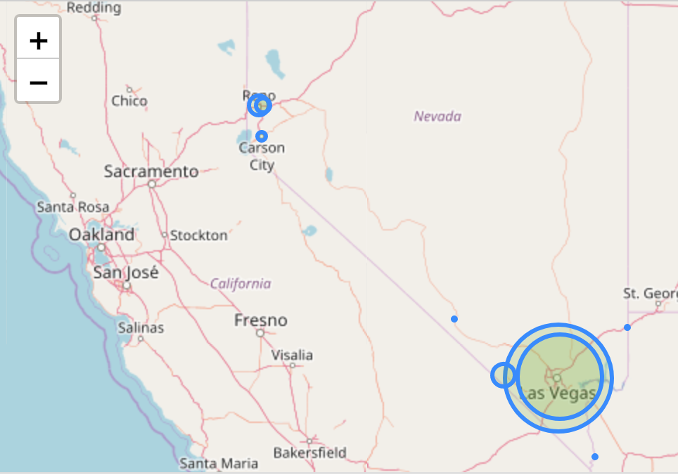
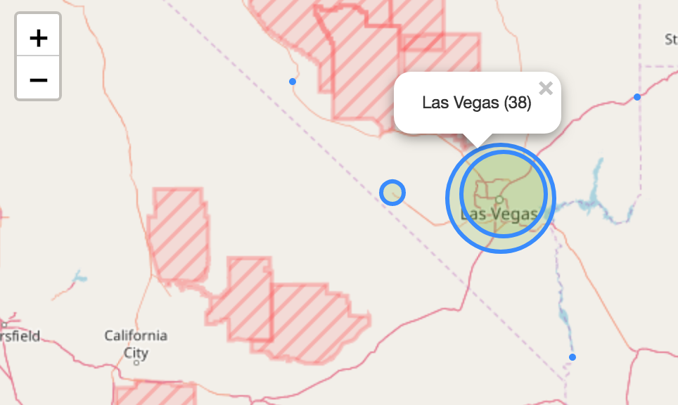
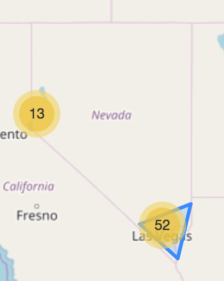

# State of Nevada - Adult Use - Licensees

## Source

Excel Spreadsheet: "All Adult-Use Establishments"
[http://marijuana.nv.gov/uploadedFiles/taxnvgov/Content/Forms/Marijuana-Licensee-List.xlsx](http://marijuana.nv.gov/uploadedFiles/taxnvgov/Content/Forms/Marijuana-Licensee-List.xlsx)

## Processing

### Data Preparation

For expedition, used Numbers to export as CSV (`nevada-licensees.csv`)

* Removed unnecessary header
* left column names as-is
* exports six sheets as individual csv files
  * columns similar across sheets

#### Exported Files

##### Retail Cultivation Licensee List

* File: `Cultivation-Table 1.csv`
  * Name (`ME Entity Name`)
  * dba (`Dba`)
  * City (`Loc City`)

##### Retail Store Licensee List

* File: `Dispensary-Table 1.csv`
  * Name (`ME Entity Name`)
  * dba (`Dba`)
  * Street Address (`Loc Addr`)
  * City (`Loc City`)

##### Retail Production Licensee List

* File: `Production-Table 1.csv`
  * Name (`ME Entity Name`)
  * dba (`Dba`)
  * City (`Loc City`)

##### Retail Lab Licensee List

* File: `Lab-Table 1.csv`
  * Name (`ME Entity Name`)
  * dba (`Dba`)
  * City (`Loc City`)
  * `Notifications` - only one, that a lab is suspended

##### Retail Distribution Licensee List (ME)

* File: `MME Dist-Table 1.csv`
  * Name (`ME Entity Name`)
  * dba (`Dba`)
  * City (`Loc City`)

##### Retail Distribution Licensee List (Liquor Wholesaler) - As of 11/01/2017

* File: `369 Dist-Table 1.csv`
  * Name (`ME Entity Name`)
  * dba (`Dba`)
  * City (`Loc City`)

### Data Cleaning

#### `data_05_clean.py`

* Combines exported CSV files into one dataset
* Adds a column to distinguish licensee `type`

### Data Enhancement

#### `data_10_geocode.py`

* Uses the Google Maps API geocoding service to acquire latitude and longitude values for each licensee address
* Stores raw geocoder response for each unique address

### Data Presentation

#### `nevada-licensees.ipynb`

This file is a Jupyter Notebook which uses [Folium](https://github.com/python-visualization/folium) to visualize information on maps.

##### Nevada Cultivators by City (using Folium CircleMarkers)

##### Nevada Cultivators by City (using Folium CircleMarkers) - Las Vegas

##### Nevada Producers by City (using Folium ClusterMarkers)

